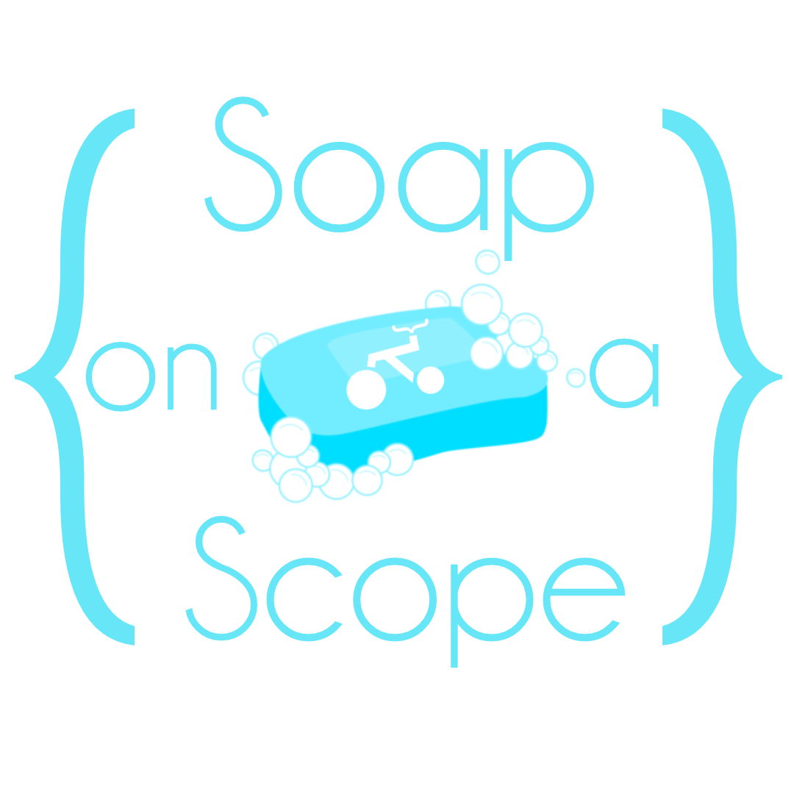

# 🧼 SoapOnAScope 🧼

A super useful sanitization library for automatically cleaning up pesky input strings! Originally modelled after the `DataAnnotations` API, `SoapOnAScope` offers a mixture of flavours to sanitize models with simple options to cover basic use cases, such as trimming and encoding.

## ▶️ Quickstart

To install the package, either use your IDE's NuGet plugin and install from the package feed, or run the following command:

```bash
dotnet add package SoapOnAScope
```

For the Web package, which adds the ability to sanitize incoming requests, you will also need to add the package:

```bash
dotnet add package SoapOnAScope.Web
```

> Note: The SoapOnAScope package is netstandard for maximum compatibility, however the SoapOnAScope.Web package must be used with a .Net 6 or higher repo.

### Sanitizer Examples

The `Sanitizer` utility

```csharp
public class Request {
    [Sanitize]
    public string Title { get; init; } = " OH NO! ";
    [Sanitize(html: true)]
    public string HtmlBody { get; init; } = " <div>Oh Yeah!</div> ";
}
```

```csharp
var request = new Request();
Sanitizer.Sanitize(request);
request.Title; // "OH NO!"
request.HTML; // "&lt;div&gt;Oh Yeah!&lt;/div&gt;"
```

## 🔍 Finding Your Way Around

## 💻 Contributing

This library is currently maintained by @lookmumnohandlebars (@alexanderjshall). Contributors are welcome - please see the [contribution guide](./docs/CONTRIBUTING.md)
